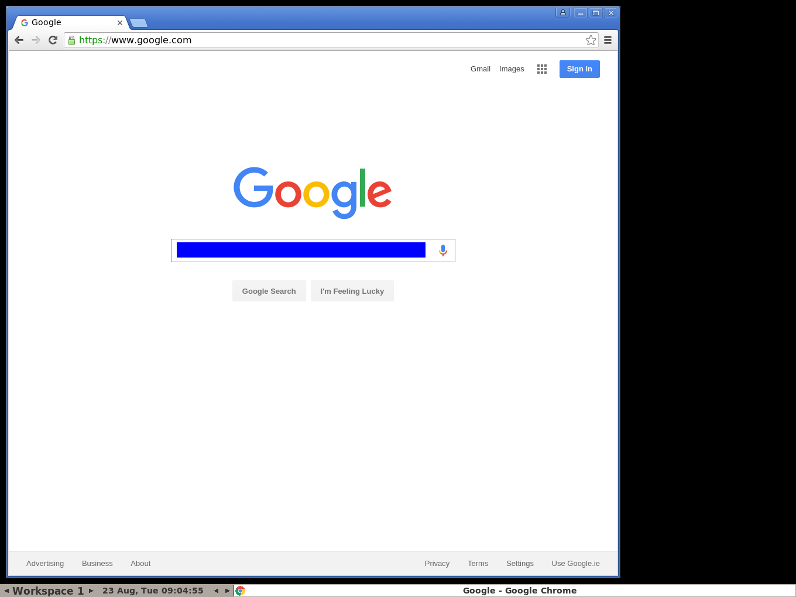
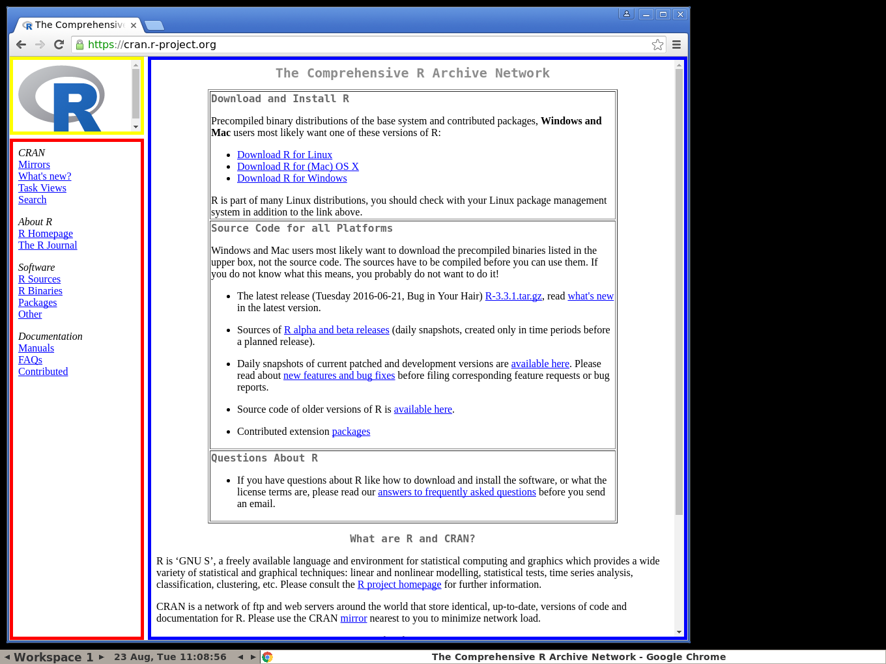
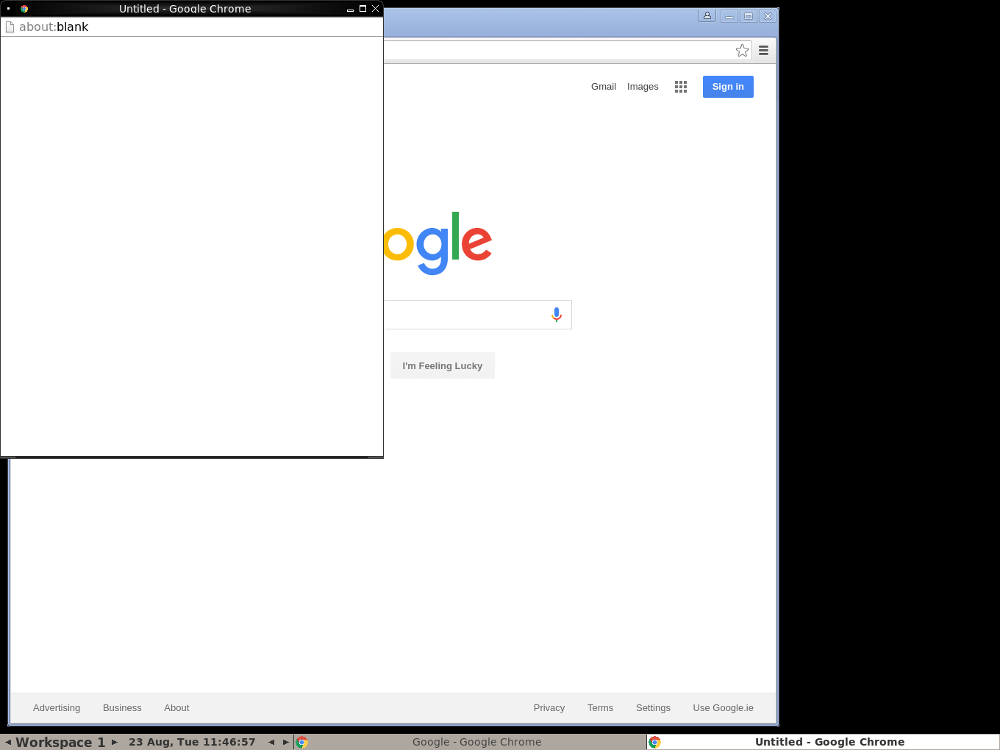
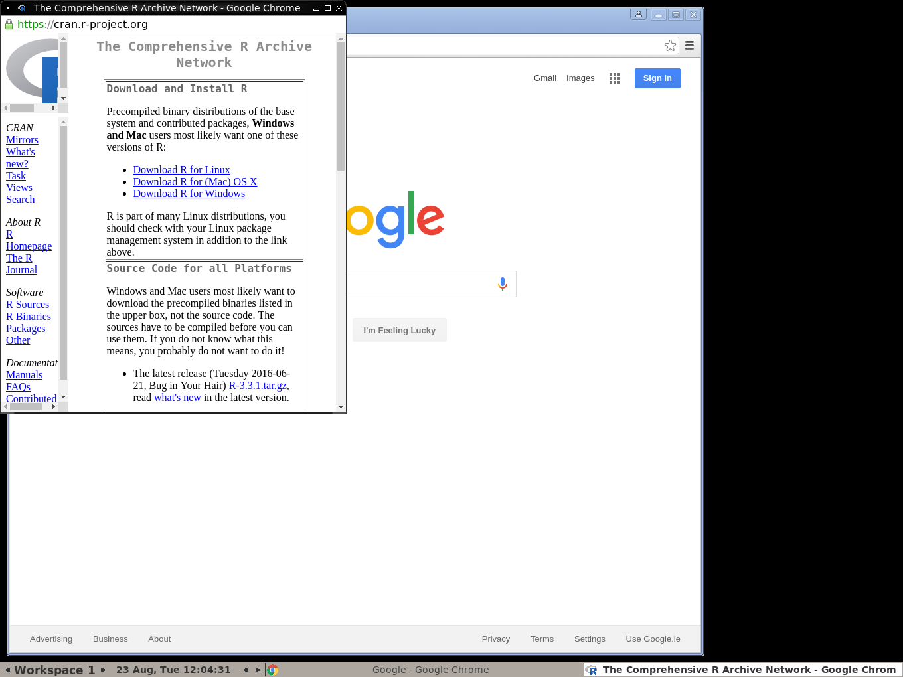
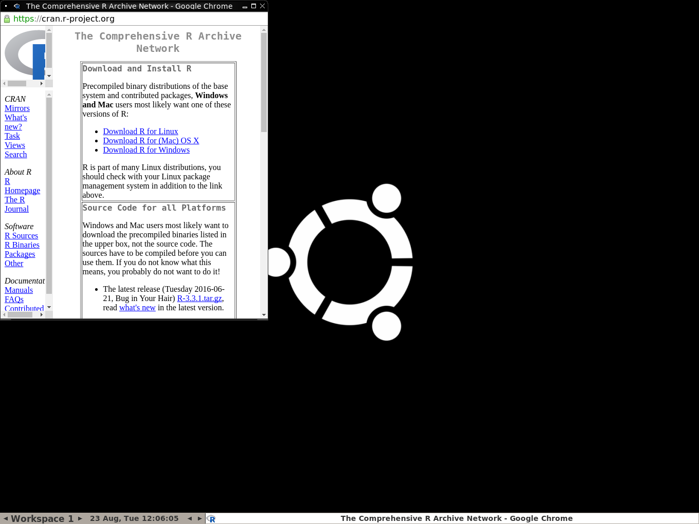

The goal of this document is to introduce the user to the `seleniumPipes` package and
to illustrate the basic operations/functions in the package.


## Introduction

WebDriver is a remote control interface that enables introspection and control of user agents. It provides a platform- and language-neutral wire protocol as a way for out-of-process programs to remotely instruct the behaviour of web browsers. 

`seleniumPipes` implements the [w3c specification](https://w3c.github.io/webdriver/webdriver-spec.html) for 
webdrivers. 

### Starting a Selenium Server 

The `seleniumPipes` package provides functions to connect to and communicate with a server which accepts w3c webdriver compliant requests. **_The `seleniumPipes` package does not provide functions or methods to manage such a server. An appropriate running server is assummed throughout._**

In this short section we will highlight some ways a server maybe started.

#### Manually starting via commandline

On a given machine a Selenium Server can be started using the stand-alone binary available from the [Selenium Project](http://selenium-release.storage.googleapis.com/index.html). This link contains version of the Selenium Server. A stand-alone binary is released with each version. 
Once downloaded it can be started via the commandline in its most basic form as:

```
> java  -jar selenium-server-standalone-3.0.0-beta2.jar
```
This assumes the file `selenium-server-standalone-3.0.0-beta2.jar` is in our path or we are issuing the command from the files directory. There are many additional options which can be passed via the commadline so of which are listed using `-help`:

```
> java  -jar selenium-server-standalone-3.0.0-beta2.jar -help
```
Other options are passed as system properties to the JVM:

```
> java -DpropertyName=value -jar selenium-server-standalone-3.0.0-beta2.jar -port 4445
```

#### Running Selenium Server via a Docker container

The Selenium Project maintains a number of [Docker images](https://hub.docker.com/r/selenium/) that can be used to run a Docker container with a Selenium Server. A introduction to running a Selenium Server via Docker containers can be found in the [RSelenium package](http://rpubs.com/johndharrison/RSelenium-Docker).

#### Start using an RScript

The user can start and manage a Selenium server via an appropriate R script. An example of sourcing and starting a Selenium Server is given in the `RSelenium package`in the `serverUtils` directory full path `file.path(find.package("RSelenium"), "examples/serverUtils")`.

## seleniumPipes basics

In what follows I am running my code on Ubuntu 16.04. The same machine has a Selenium Server running in a docker container. This Docker image can be found [here](https://hub.docker.com/r/selenium/standalone-chrome-debug/~/dockerfile/). I am
starting my Selenium server with the following `docker` command:

```
docker run -d -p 4445:4444 -p 5901:5900 selenium/standalone-chrome-debug:2.53.0
```

So I am running the standalone chrome debug image from the Selenium project at Docker Hub. I am running the version of this image with tag `2.53.0`. On my host machine the Selenium Server is exposed on port 4445 and the browser can be viewed via VNC on port 5901 on my ubuntu 16.04 host. 

**The above is only for the users information and allows them to replicate my setup. It is not necessary and the user may use any Selenium Server they have access to.**

### Connecting to the Selenium Server.

To connect to the Selenium Server `seleniumPipes` provides a `remoteDr` function which takes a number of arguments and returns an object of class `rDriver` which can be used for further interaction with the Server. 

```
library(seleniumPipes)
remDr <- remoteDr(browserName = "chrome", port = 4445L)

> remDr
Remote Ip Address: http://localhost:4445/wd/hub 
Remote sessionId: 640ad436-74e1-4ce8-afc3-898c0dee095d 

> class(remDr)
[1] "rDriver"
```

Running the above should connect to the running Selenium Server which has default ip address (localhost) and is running on port 4445 (the default is 4444). It asks to open a `chrome` browser (the default is firefox). A browser should be opened:


### Navigating

Navigation is straightforward with `seleniumPipes`. There are a number of navigation functions `go`, `back`, `forward`, `refresh` etc. 

|Piped version      | Non piped|
|------------------------------------------- |-----------------------------------------|
|`remDr %>% go("http://www.google.com/ncr")` | `go(remDr, "http://www.google.com/ncr")`|
|# get the title|  |
|`remDr %>% getTitle` | `getTitle(remDr)`|
|# get the current page url | |
|`remDr %>% go("http://www.bbc.co.uk") %>% getCurrentUrl`| `getCurrentUrl(go(remDr, "http://www.bbc.co.uk"))`|

|Piped version      | Non piped|
|------------------------------------------- |-----------------------------------------|
|# go back|  |
|`remDr %>% (seleniumPipes::back)` | `seleniumPipes::back(remDr)`|
|# go forward|  |
|`remDr %>% forward` | `forward(remDr)`|
|# refresh page|  |
|`remDr %>% refresh` | `refresh(remDr)`|

We give the package path with the `back` function `seleniumPipes` as there is a `rvest::back` function which users
may have in their workspace. If there are no namespace clashes `back` can simply be used.

**From now on we will be using piped versions of our commands** and not listing the Non piped versions. `seleniumPipes` enables chaining by returning appropriate objects from functions and piping will ease our code writing in this case.

### Closing the browser/Session

To close the browser and remove the session from the Selenium Server we use the `deleteSession` function.

```
remDr %>% deleteSession
```

The browser on the machine running Selenium Server should now be closed and the session removed from the Selenium Server.

## Finding elements and interacting with elements

There are a number of functions in `seleniumPipes` that find elements in the DOM of the remote browser. They return objects of class `wElement` and can be used for further chaining. 

### Selectors and elements

The `findElement` function allows the user to search for an element in the remote browser DOM. 

```
remDr <- remoteDr(browserName = "chrome", port = 4445L)
remDr %>% go("http://www.google.com/ncr")

# find the search form query box and search for "R project"
webElem <- remDr %>% findElement("name", "q")
```

If the selector returns a match an object of class `wElement` is returned:

```
> webElem
ElementId: 0 
Remote Driver: 
Remote Ip Address: http://localhost:4445/wd/hub 
Remote sessionId: 53f7a733-0e0e-4f73-87f2-e141ed530ebe 
> class(webElem)
[1] "wElement"
```

There are a number of different ways to search for an element. `xpath`, `css`, `id` are all examples of how a search can be carried out. Look at the help files for more info (`?findElement`)

### Send text to an Element/ Click on an Element

There are a number of functions which allow you to interact with the element in the DOM.
As an example `?elementSendKeys`. Looking at the help file we see other functions in the `elementInteraction` group. As an example we will send some text to the google search box, clear it then send different text and submit it by pressing the search button.

```
queryBox <- remDr %>% findElement("name", "q")
# send text to the query box
queryBox %>% elementSendKeys("Some ", "text")

# clear the query box
queryBox %>% elementClear

# get the search button
searchBtn <- remDr %>% findElement("name", "btnG")
# send text to query box
queryBox %>% elementSendKeys("R project")

# click the search button
searchBtn %>% elementClick
```

## Running JavaScript on remote browser

Using `seleniumPipes` we can inject JavaScript into the remote browser. There are two functions executeScript and executeAsyncScript which execute JavaScript synchronously and
asynchronously respectively. 

### Executing synchronously

Synchronous execution executes the script and returns any values. We can pass arguments to our script as follows:

```
> remDr %>% executeScript("return 1+1;")
[1] 2
> remDr %>% executeScript("return arguments[0]+1;", list(1))
[1] 2
> remDr %>% executeScript("return arguments[0]+arguments[1];", list(1,2))
[1] 3

```

### Passing and returning webElements
We can pass a web Element as an argument to the `execute` functions and also have
web Elements returned. 

#### Pass a web Element
As an example we navigate to the Google home page. We select the search box in the DOM. We then pass the resulting web element back in our script
and change the search box color:


```
searchElem <- remDr %>% go("http://www.google.com/ncr") %>% 
  findElement("name", "q")

blueScript <- "arguments[0].style.backgroundColor = 'blue';"
remDr %>% executeScript(blueScript, list(searchElem))

```



#### Return a web Element

We can return web Elements from our script also. When web Elements are detected they are converted. This option is converned by the`replace` argument. By default elements in the DOM are replaced with web Elements.

As an example lets refresh our page and return the google logo:

```
logoScript <- "return document.getElementById('hplogo');"
logoElem <- remDr %>% refresh %>% 
  executeScript(script = logoScript, args = list())
```

We can check that we have a web Element returned. We can also pass it back and change the visibility of the logo:

```
#> logoElem
#ElementId: 1 
#Remote Driver: 
#Remote Ip Address: http://localhost:4445/wd/hub 
#Remote sessionId: 5e322e1a-c06e-43c3-bebe-fe4465e0df7a 

remDr %>% executeScript("arguments[0].hidden = true;", args = list(logoElem))

# and turn the visibility back on
remDr %>% executeScript("arguments[0].hidden = false;", args = list(logoElem))

```

Finally we show a slightly more complex object being returned with `replace` as `TRUE` and `FALSE` respectively

```
# Return a web Element in a more complex object
script <- "var test ={num:1, str:'a', el:document.getElementById('hplogo')};return test;"
remDr %>% executeScript(script = script
                        , args = list())
# $str
# [1] "a"
#
# $num
# [1] 1
#
# $el
# ElementId: 0
# Remote Driver:
#   Remote Ip Address: http://localhost:4444/wd/hub
# Remote sessionId: 9a83672a-d72b-4873-aa7d-96f7f1f80fa0

# Run with replace = FALSE
remDr %>% executeScript(script = script
                        , args = list(), replace = FALSE)
# $str
# [1] "a"
#
# $num
# [1] 1
#
# $el
# $el$ELEMENT
# [1] "0"
```

### Executing asynchronously

By default the timeout on scripts is effectively set to zero. Asynchronous execution basically
means our function waits for the script to finish execution. An appropriate value should be set 
for script timeouts. Here we choose the default value of 10 seconds (10000 millisconds).

A callback function is passed as the last argument and we `call` this function to signal ouyr script is finished.

Here is an example illustrating the difference between sync calls and async calls:

```
remDr %>% setTimeout("script") # set default 10 secs for script timeout

asScript <- "cb = arguments[0];setTimeout(function(){cb('DONE');},5000); "
system.time(test1 <- remDr %>% executeAsyncScript(asScript, args = list()))
sScript <- "setTimeout(function(){},5000); return 'DONE';"
system.time(test2 <- remDr %>% executeScript(sScript, args = list()))

```
As a slightly more involved example:

```
script <- "
        var cb = arguments[ arguments.length - 1 ];
        secondValue = arguments[0];
        setTimeout(function () {
           cb({
              firstValue: 1,
              secondValue: secondValue
           });
        }, 3000);
"
res <- remDr %>% executeAsyncScript(script = script, list("Super 2nd value"))

#> system.time(res <- remDr %>% executeAsyncScript(script = script, list("Super 2nd value")))
#   user  system elapsed 
#  0.032   0.000   3.103 
#> res
#$secondValue
#[1] "Super 2nd value"
#
#$firstValue
#[1] 1
remDr %>% deleteSession()
```

Notice we can return a JavaScript object.

## Error handling

By default there is a built-in `retry` function in the `seleniumPipes` codebase. If a call
to the server returns an error the call is tried a number of times. See `?retry` for more details.

By default functions are tried three times with a 5 second delay between tries. These values 
can be changed see the package options `?seleniumPipes`.

### Retry in action
As an example of how the `retry` functionality works consider the following
```
remDr <- remoteDr(browserName = "chrome", port = 4445L)
webElem <- remDr %>% go("http://www.google.com/ncr") %>% 
  findElement("name", "q")

# change the name of q with an 8 second delay
myscript <- "var myElem = arguments[0]; window.setTimeout(function(){
 myElem.setAttribute('name','funkyname');
}, 8000);"
remDr %>% executeScript(myscript, args = list(webElem))

newWebElem <- remDr %>% findElement("name", "funkyname")

# > newWebElem <- remDr %>% findElement("name", "funkyname")
# 
# Calling  findElement  - Try no:  1  of  3 
# 
# Calling  findElement  - Try no:  2  of  3 

newWebElem %>% getElementAttribute("name")
```

In the above we navigate to the google homepage. We select an element in the DOM with name `q`. 
We change the name of the element but set an 8 second delay on the change. Then we try to find the element. The first two attempts fail. The third attempt successfully finds the element as our 8 second delay is over and the time between function calls is a default 5 seconds. 


### Changing retry values

We can effectively turn `retry` off by setting appropriate options e.g.

```
# options(seleniumPipes_no_try = 1L)
# options(seleniumPipes_no_try_delay = 50L)

```
which would limit calls to a given function to 1 try and a 50 millisecond delay. We can also 
pass a retry argument in all the package functions

```
remDr %>% findElement("id", "i am not here", retry = list(noTry = 5, delay = 10))
remDr %>% findElement("id", "i am not here", retry = FALSE)

remDr %>% deleteSession
```

## Frames and Windows

Sometimes websites can be composed using frames. These are in effect seperate webpages which are brought together in a frameset. A webdriver 
needs to switch from frame to frame. The easiest way to explain this is by way of example. 

### Interacting with frames

The `r-project` web-page at `CRAN` conviently uses frames so we will interact with it:

```
remDr <- remoteDr(browserName = "chrome", port = 4445L)

remDr %>% go("https://cran.r-project.org/") %>%
  getPageSource %>% 
  xml_find_all("//frame") %>% 
  xml_attr("name")

# [1] "logo"     "contents" "banner"  
```

So we have navigated to the `CRAN` page, returned the page source, passed it to some functions in `xml2` which have returned the frame `names`.

We can have a look at the structure of the html:

```
remDr %>% getPageSource %>% 
  html_structure
#<html [xmlns]>
#  <head>
#    {text}
#    <title>
#      {text}
#    {text}
#    <meta [http-equiv, content]>
#    {text}
#    <link [rel, href, type]>
#    {text}
#    <link [rel, href, type]>
#    {text}
#    <link [rel, type, href]>
#    {text}
#  {text}
#  <frameset [cols, style]>
#    {text}
#    <frameset [rows]>
#      {text}
#      <frame [src, name, frameborder]>
#      {text}
#      <frame [src, name, frameborder]>
#      {text}
#    {text}
#    <frame [src, name, frameborder]>
#    {text}
#    <noframes>
#      {text}
#    {text}
#  {text}
```
Looking at the structure we can see the three frames we found. The logo frame contains simple the logo. The contents frame is the side menu on the left and the banner frame is the main section on the right. Lets inject some JavaScript to make this clearer:


```
frames <- remDr %>% findElements("css", "frame")

script <- "arguments[0].setAttribute(arguments[1], arguments[2]);"
style <- paste("border: 5px solid", c("yellow", "red", "blue"))

remDr %>% {lapply(seq(3), function(x){
  executeScript(., script, list(frames[[x]], "style", style[x]))
})
}

```
The above code colors the frames yellow (logo), red(content) and blue(banner).




We can see the links in the red (content) frame. Lets try to get them

```
remDr %>% getPageSource %>%
  xml_find_all("//a")
{xml_nodeset (0)}
```
As we can see there are no html links in the html source returned. 

#### Switch to frame

Lets switch to the 2nd frame (red) and try again

```
remDr %>% switchToFrame(frames[[2]]) %>% 
  getPageSource %>%
  xml_find_all("//a") %>% 
  xml_text

#[1] "Mirrors"       "What's new?"   "Task Views"    "Search"        "R Homepage"    "The R Journal" "R Sources"    
#[8] "R Binaries"    "Packages"      "Other"         "Manuals"       "FAQs"          "Contributed"  
```

To switch to the parent frame we pass NULL (this is the default value)

```
remDr %>% switchToFrame
```

Finally lets switch to the blue frame and get all the R download links:

```
remDr %>% switchToFrame(frames[[3]]) %>% 
  getPageSource %>% 
  xml_find_all("//a[contains(., 'Download R')]") %>% 
  xml_attr("href")

# [1] "bin/linux/"   "bin/macosx/"  "bin/windows/"

remDr %>% deleteSession
```
So we can see the relative download urls returned.

### Interacting with windows

Windows are a bit like frames. We can switch between windows in a similar fashion. Again an example might be the best method
to illustrate windows.

```
remDr <- remoteDr(browserName = "chrome", port = 4445L)
remDr %>% executeScript("window.open('', '_blank', 'location=yes,height=570,width=520');")
remDr %>% go("http://www.google.com/ncr")

```


So we can see the two windows. The current window is in the background and we can see we have navigated to the google homepage.

Windows are designated by ids referred to as handles. We can examine our windows:

```
allHandles <- remDr %>% getWindowHandles

#> allHandles
#[[1]]
#[1] "CDwindow-2BD80006-8759-44F8-9797-3E5C3DF5DD01"
#
#[[2]]
#[1] "CDwindow-5A904D54-3C04-43B1-85A2-2F2B00560C07"

currentHandle <- remDr %>% getWindowHandle

#> currentHandle
#[1] "CDwindow-2BD80006-8759-44F8-9797-3E5C3DF5DD01"

newHandle <- allHandles[!allHandles %in% currentHandle][[1]]

#> newHandle
#[1] "CDwindow-5A904D54-3C04-43B1-85A2-2F2B00560C07"

```
The `getWindowHandles` function returns all the windows in the session. The `getWindowHandle` returns the current window. We can use the switchToWindow

```
remDr %>% switchToWindow(newHandle) %>% 
  go("https://cran.r-project.org/") %>% 
  getTitle
  
#[1] "The Comprehensive R Archive Network"
```

```
remDr %>% switchToWindow(currentHandle) %>% 
  getTitle
#[1] "Google"
```



Finally we can close the current window (in this case the first window with google) using the `closeWindow` function:

```
remDr %>% closeWindow
```


Lastly we delete the session
```
remDr %>% deleteSession
```

## Chaining of `seleniumPipes` functions
`seleniumPipes` functions best when functions are chained together. The `?retry` functionality also gives a failsafe for when a page may not have loaded or an element in the DOM is not ready. As an example we shall:

* Navigate to google
* Search for "CRAN r-project"
* Click the first search result
* Manipulate the frames at http://cran.r-project.org
* Switch to the third frame
* Get all the "Download R" urls


```
remDr <- remoteDr(browserName = "chrome", port = 4445L)

# search for CRAN and the r project
remDr %>% go("http://www.google.com/ncr") %>% 
  findElement("name", "q") %>% 
  elementSendKeys("CRAN r-project", key = "enter")

# click the first link
remDr %>% findElement("css", "h3.r") %>% 
  elementClick

# manipulate the frames. select the third
appFrame <- remDr %>% findElements("css", "frame") %>% 
  magrittr::extract2(3) 

# switch to the third frame and get all the links containing "Download R"
remDr %>% switchToFrame(appFrame) %>% 
  findElements("xpath", "//a[contains(., 'Download R')]") %>% 
  sapply(getElementAttribute, attribute = "href")

#[1] "https://cran.r-project.org/bin/linux/"  
#[2] "https://cran.r-project.org/bin/macosx/" 
#[3] "https://cran.r-project.org/bin/windows/"

remDr %>% deleteSession
```


